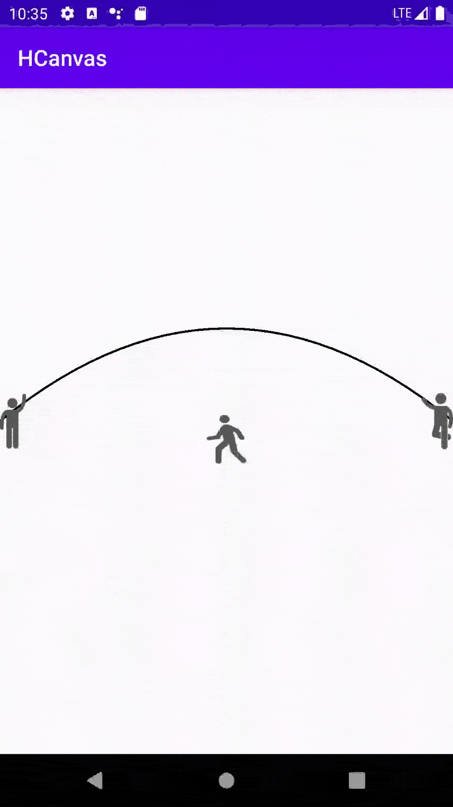

## 跳绳火柴人



## 使用方法
```kotlin

 val d = PathDrawable(this)
        view.setBackgroundDrawable(d)
        val l: View.OnClickListener = View.OnClickListener { d.startAnimating() }
        view.setOnClickListener(l)

```

        
